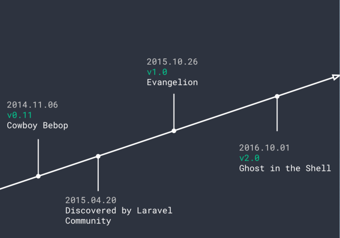
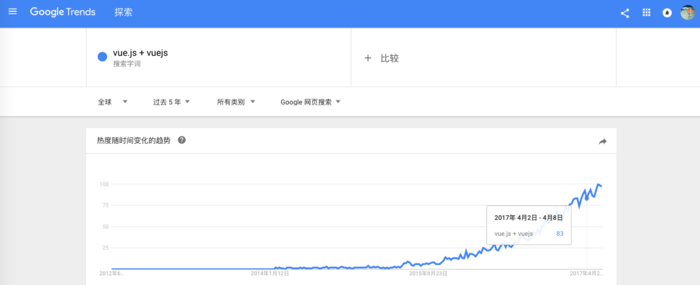
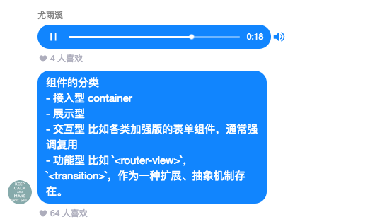
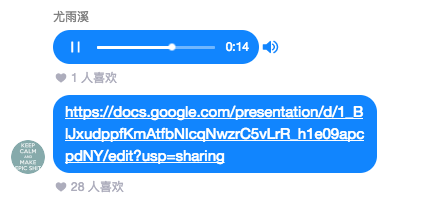
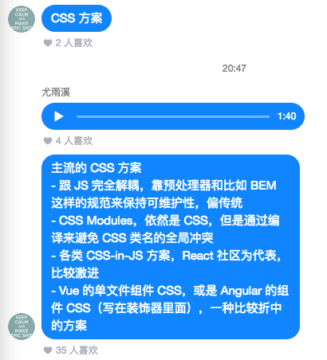
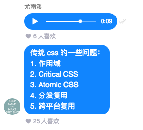
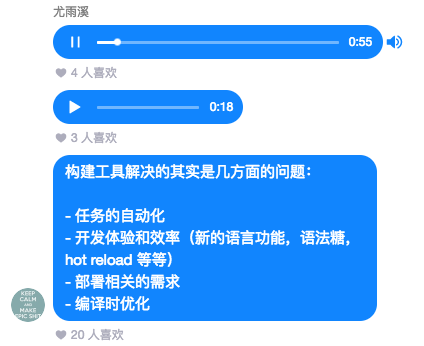
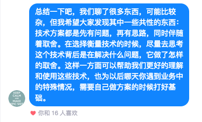

### Welcome to use MarkDown
### 本文摘自 https://www.jianshu.com/p/5449f51ca90f
#  vue起源
####  由 Vue.js 官方、W3C 中国、w3ctech 和前端圈共同举办的全球首届 VueConf 于 2017 年 5 月 20 日在北京成功举办不久，Vue.js 的作者尤大(尤雨溪)便在知乎社区知乎 live上与广大(大)前端爱好者线上交流。本次的主题便是 —— 《不吹不黑聊聊前端框架》。整场 live 言简意赅，贯穿着很多英文专业用语，通览了前端框架的历史、现状与未来。

#### Vue 从 2013 年 6 月第一个 Commit 开始本来是要做一个“Just a View Layer Library”，即前端的视图层库，逐渐在更多的大型项目实战中肩负起了 “The Progress Framework”的框架使命，渐进式地加入了各种辅助工具(视图层渲染、组件机制、路由机制、状态管理、构建工具)。

可以这么通俗理解：库是将代码集合成的一个产品，供程序员调用。框架则是为解决一个(一类)问题而开发的产品。框架是库的升级版。

不到一年后 Vue 第一次公开发布，次年进入 Laravel 社区并得到充分的推广。便形成了我们现在看到的 Github Top 10、NPM 每月 55w+ 次下载(不包括 cnpm 等国内镜像站点数据)、Chrome 插件 10w+ 周活跃用户的现状。

前端届也藉此出现了一批一批基于 VUE 的框架、组件。

# 语录
* 定个基调，与其争论和 Vue 比哪个框架好，不如针对更多的开发者群体和场景形态来提高社会价值。
* 如何针对不同的场景需求来选择工具？应对框架背后所要解决的问题有所理解。应该透过框架的表层来梳理要解决的问题。
* Virtual DOM 现在有各种各样实现，并不神秘，可以自己实现。
* 直接在 HTML 里写 onclick ，里面 JavaScript 作用域是全局的。而在 Vue 组件里写时，JavaScript 作用域是被束缚好的。
* 把 Vue 当 redux 用。
* 让 Vue 当 MobX 用。
* 路由是大型单页应用才会遇到的问题，传统的路由思想是“侵入式”的，比如最早在前端有路由概念时写应用得先从路由写起。
* Web 路由和 APP 路由的区别，总体上都是将 URL 映射到组件树。
* 最早的前端构建工具 Grunt、Gulp 等现在用的少的原因是它们执行自动化的功能现在 npm script 完全就可以替代，没必要依赖它的各种插件。
* Webpack 很复杂，复杂的原因是它要解决的问题就很复杂。
* 前端渲染永远避不过 JS 加载执行完之后内容才出现。
# 问答

* 点到辄止，将大致的主流方向

* 微博上有他的一篇分析 Vue 2.0 源码的文章 [《Vue2.1.7源码学习》。](http://hcysun.me/2017/03/03/Vue%E6%BA%90%E7%A0%81%E5%AD%A6%E4%B9%A0/)

* 定个基调，与其争论和 Vue 比哪个框架好，不如针对更多的开发者群体和场景形态来提高社会价值。
* 如何针对不同的场景需求来选择工具？应对框架背后所要解决的问题有所理解。应该透过框架的表层来梳理要解决的问题。
* 组件如何一步步成为主流？最早的前端以页面为主，后来转为应用，从而有模块封装的需求，组件树的概念就出现了。React 解释了一个事实：组件可以就是函数，组件间可以调用其他的函数。React 默认的组建形式还是 State，实际应用中组件是分类的。
* 纯展示型的组件，数据进，DOM 出。
* 接入型组件，会跟数据层的 Service 打交道( React container)，把数据往下传，传到展示型组件
* 交互型组件，是对与表单组件的封装和加强，Element UI等以交互性组件为主，会有比较复杂的、可高度复用的逻辑。
* 功能型组件，Vue 场景下，路由等组件本身不渲染任何内容，作为一种拓展和抽象型机制出现。
* 模板和 JSX 的对比，JSX 获得了 JAVASCRIPT 的灵活度，对书写功能型组件时更好，模板对纯展示型组件的书写更好。
* 模板尽可能让更少的逻辑放到视图里，逻辑少的模板在写样式的时更能视图化的思考。
* Collocation 把应该放一起的东西放一起，比如在 Vue 单文件里把模板、样式、JavaScript 样式放到一起。比如 React 里用 JSX，NG 里把模板和 Style 放到装饰器里。传统的分层以语言文件为区分。
* 变化侦测和渲染机制：渲染这里最重要的是声明式(数据和 DOM 之间有映射关系，不需要我们直接去手动操作)，相比较的是命名式(用 JQuery 直接操作 DOM，但会很快遇到维护问题)
* 熟悉 React 都知道一个等式：View = render(state) 。
* Virtual DOM 现在有各种各样实现，并不神秘，可以自己实现。

* 变化侦测，Vue 的数据是响应式的，把数据交给 Vue 时，Vue 会进行转化，当改变数据值时，Vue 会做更新。
* 巴黎演讲 PPT
* 变化侦测主要分为 push 和 pull 两种。React 的 setstate 和 NG 的脏检查都是 pull，系统不知道数据是否已改变，需要进行 pull。相比之下 push 在数据变动时会立刻知道哪些数据改变。pull 是粗粒度的，Push会进行更细粒度的更新，但会有相应内存开销、依赖追踪开销的代价。
* Vue 里选择中等方案(混合式)，组件里选择 push，每个组件都是 watcher。组件内部使用 Virtual DOM 进行比较。

* 直接在 HTML 里写 onclick ，里面 JavaScript 作用域是全局的。而在 Vue 组件里写时，JavaScript 作用域是被束缚好的。
* Vue 组件里可以直接写 onclick 的原因是组件和模板是一起的，不会造成维护的困难。
* 状态管理这个概念是 Facebook 提出 Flux 后慢慢被大家所熟知。Flux 在经历初期混乱竞争后，React 逐渐“合并”到了 Redux 上。VueX 一定程度上受 Redux 影响。状态管理的本质是从原事件映射到状态的迁移与改变，再映射到 DOM UI 的变化(eg: 从点击一个按钮到点击事件被触发的过程)。
* 声明式的渲染已经帮我们解决了从状态到 UI 这一块。状态管理的库实际做的是如何管理将事件源映射到状态变化的过程，如何将映射过程从视图组件中剥离出来，提高可维护性，状态管理主要解决的这类问题。

* Redux 强调的是数据不可变，函数式的，Reducer 里是一个纯函数，我们拿到一个 state 和 action 返回一个新的 state。MobX 和 Vue 里体现了不同的思维方式(“范式”)，数据是响应式的，框架已经在数据上做好了声明式副作用的声明。

* 可变数据难维护是当我们手动操作数据副作用操作，手动观察时会带来一定维护上的成本。
* [把 Vue 当 redux 用](https://jsfiddle.net/yyx990803/0a22ojps/)

* [让 Vue 当 MobX 用 ](https://jsfiddle.net/yyx990803/f5a24dk3/)
* 之前的方案其实都没有回答如何处理异步的问题。Redux 是将这件事交给 MiddleWare 去做，MobX 和 VueX 是让用户在 action 里做。
* Redux 的各种解决方案其实各成一派。
* 这些复杂的异步在简单的应用中，其实杀鸡不用上牛刀，因为在一个典型的 rest api 不存在太复杂的异步。比较复杂的事件源比如服务端推送、实时处理、多个同时请求等，应该专门做一层来处理这个问题。
* 状态改变在 Redux 里用 Reducer，这些状态的改变在传统机制里要写出来。现在的状态管理方案还面临一些尴尬：组件的局部状态和全局状态如何区分？

* 路由是大型单页应用才会遇到的问题，传统的路由思想是“侵入式”的，比如最早在前端有路由概念时写应用得先从路由写起。
* 当 React 和 Vue 这种专注于 View 层的库出现后，其实发现把组件和路由解耦是完全可行的，而且更灵活。比如 React 不带路由直接用时没有问题的。另一个启示是从组件出发思考路由问题，本质上就变成把一个 URL 映射到组件树结构的一个过程。
* 像 NG 的路由重写过好几次，最后采用的是一个路径映射到组件的形式。React 和 Vue 也是提供路由映射的基本元素。NG 很早也提出了把组件作为用作路由的组合方式，但到现在很久都没有做出来。
* 在 URL 到组件的映射有一些小的问题：到底应该从 URL 出发还是以状态出发？比如说一些路由库的实现是以状态之间的迁移为核心的。但其实也可以把 URL 理解为一个序列化的状态。
* 最简单的路由其实就是一个动态组件。React 可以用对象表等实现。但一旦我们实际做一个单页应用会遇到跟多的问题：重定向、别名、懒加载，路由的钩子跳转如何应对用户取消跳转时让跳转无效的情况等等。
* 现在主流的路由方案都有点相似，比较有意思的是最新的，用组件本身做路由的思想，很大程度上利用了“功能型组件”。父组件里可以声明式的渲染其他组件。它和传统的路由方案是去中心化的，将路由写到各个组件中。但拥有相比集中式的路由表的应用来说，去中心化的路由对于跳转的管理会更弱等。
* Web 路由和 APP 路由的区别，总体上都是将 URL 映射到组件树。原生应用的跳转模式和 Web 是有区别的，前者向一叠卡片一样，新的界面是盖在旧的界面上；Web 的路由方案做移动应用时会比较别扭。这里可以考虑考虑如何更好的发展。

* 对于现在应用中的 CSS 有几种主流的实践：一类是跟 JS 完全解耦，靠预处理器和比如 BEM 这样的规范来保持可维护性，偏向传统， CSS 完全独立于应用书写。另一种是 CSS Module，通过编译来避免 CSS 类名的全局冲突；各类 CSS-in-JS 方案，React 社区为代表，比较激进。Vue 的单文件组件 CSS，或是 Angular 的组件 CSS（写在装饰器里面），是一种比较折中的方案。
* 比较 CSS 方案时首先要明确场景的问题，如果应用逻辑已经组件化了，是一个比较复杂应用的开发，传统的 CSS 方式可维护性就有问题了。把组件和结构同义化是减低思维负担的一种方式。
* https://speakerdeck.com/vjeux/react-css-in-js
* CSS-IN-JS 在社区的意见比较分裂。A Unified Styling Language

* 传统 CSS 的一些问题：作用域、Critical CSS、Atomic CSS、分发复用、跨平台复用等。
* CSS-IN-JS 解决了一些问题。作用域很简单直接：我们不希望 CSS 污染组件全局时，可以用 CSS MODLE 等解决。服务端渲染 CSS 时要有办法侦测到将要用什么 CSS。
* 跨平台复用我们可以把静态的 CSS PASS 后编译成跨平台的 JS。
* 尤大个人对 CSS-IN-JS 持保留态度，毕竟用静态 CSS 进行编译时的分析和优化会更简单。因此 CSS-IN-JS 未必是未来的方向。

* 没有本质的优劣区别，scoped 的成本回更低一点，但可能会导致植出页面会大一些。

* 现在的前端开发环境需要安装很多工具，发展成这样的原因是 Web 的能力越来越强，外部需求越来越高，因此需要开发工具和开发环境越来越好。
* 构建工具解决的其实是几方面的问题：任务的自动化、开发体验和效率（新的语言功能，语法糖，hot reload 等等）、部署相关的需求，编译时优化。
* 最早的前端构建工具 Grunt、Gulp 等现在用的少的原因是它们执行自动化的功能现在 npm script 完全就可以替代，没必要依赖它的各种插件。Gulp 在构建这块引入流的思想，但跟以模块为核心的构建工具比，就比下去了。npm scrtip + Webpack 渐渐成了主流。

* 开发体验这块，前端比较有意思的限制是最终代码不可避免要跑在浏览器里，在我们使用 CSS、JS 新特性时要考虑浏览器的限制，因此前端的构建工具链渐渐变得很完善。
* 张云龙 - 大公司里怎样开发和部署前端代码？
* 分模块后不可能一个应用几十个请求过去，我们可以将多个文件打成一个包。Webpack 看起来只是代码打包，其实仔细深思会发现部署优化里要做很多事情。比如 JS 中静态资源的内联，不同资源刷新版本时如何缓存，如何代码分割，Webpack 可以避免我们手动进行“前端运维”。
* Webpack 很复杂，复杂的原因是它要解决的问题就很复杂。
* 严谨的前端工程肯定要走“编译”这一步。

* 虽然 Vue 本身用 flow，但建议使用 TypeScript 的 flow，主要从开发体验、生态完善度上考虑。
* 服务端数据通信中，长久以来我们围绕的是 Rest，如果服务端暴露出了一个标准的 Rest Api，客户端可以直接围绕 Rest 做封装。
* 关于解决数据管理的方案，比起像 Rest 这样围绕资源做管理，我们可以使用

* [Vue.js 跨平台渲染指南](https://ssr.vuejs.org/en/)
* 从前端框架角度看，跨平台渲染本质是在设计框架的时候要在框架的渲染机制和 DOM 解耦，并不一定使用 Virtual DOM。本质上只需要把框架更新时结点操作封装起来便可做到跨平台。
* 一个原生的渲染引擎，比如 React Native 和 VueX 本质都是在底层针对每个平台有一个适配的渲染引擎，只要把渲染引擎暴露的结点操作的 API，跟框架运行时对接一下，就可以实现将框架里面的代码渲染到原生的目的。这里的解耦很清晰，这也是为什么能看到 NG 可以接 React Native，VueX 可以跑 Vue 文件，VueX 可以跑在 NativeScript 上等等。
* Web Components，Web Component 和类 React、Angular、Vue 组件化技术谁会成为未来？
* WebAssembly，面向 Web 的通用二进制和文本格式，可以跑在浏览器里面。但是在目前的形势下，WebAssembly 暂时还操作不了 DOM。
* 之后前端外刊评论会有针对尤大的采访。

* 现阶段 React 和 Vue 在场景上区别很小，所以应从团队效率、团队后续招人等方面考虑。两者能胜任的场景是差不多的。

* 理解思想最重要，熟悉源码能提升自己工程化的理解，对自己写库有帮助，但对业务帮助很小。

* 前端渲染永远避不过 JS 加载执行完之后内容才出现。

* HTTP2 跟打包优化互相之间作用是非常复杂的关系，和代码量、网络环境都有关系，只能实际测量和找数据才可。

